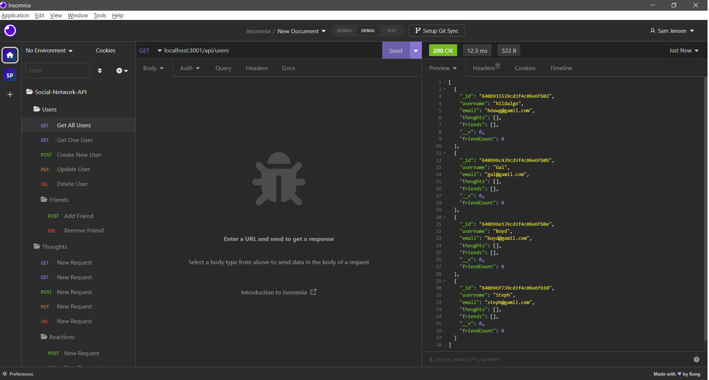

# Social-Network-API


## Description:
API for a social network web application where users can share their thoughts, react to friends’ thoughts, and create a friend list.
## Table of Contents:
* [Installation](#installation)
* [Usage](#usage)
* [License](#license)
* [Contributing](#contributing)
* [Tests](#tests)
* [Questions](#questions)
### Installation:
```bash
git clone https://github.com/Samualjensen/Social-Network-API.git
```
```bash
npm i
 ```
### Usage:

### License
[MIT License](https://opensource.org/licenses/MIT)
### Contributing
1. **Fork** the repo on GitHub.
2. **Clone** the project to your own machine.
3. **Commit** changes to your own branch.
4. **Push** your work back up to your fork.
5. Submit a **Pull request** so that your changes can reviewed.
### Tests
N/A
### Questions
My Github profile can be found at [Github](https://github.com/Samualjensen), or contact Sam Jensen at samual.jensen@gmail.com.
